# 📚 Complete C Programming Notes for Beginners
## A Visual Guide to Mastering C Programming from Zero to Interview Ready

---

# Table of Contents

1. [Core Basics](#-1-core-basics)
2. [Functions](#-2-functions)
3. [Arrays & Strings](#-3-arrays--strings)
4. [Pointers](#-4-pointers-critical-topic)
5. [Memory Management](#-5-memory-management)
6. [Structures & Unions](#-6-structures--unions)
7. [File Handling](#-7-file-handling)
8. [Preprocessor & Macros](#-8-preprocessor--macros)
9. [Storage Classes](#-9-storage-classes)
10. [Bit Manipulation](#-10-bit-manipulation)
11. [Important Concepts](#-11-important-concepts)
12. [Common Coding Questions](#-12-common-coding-questions)
13. [Advanced Topics](#-13-advanced-topics)

---

# 🧠 1. Core Basics

## What is Programming?

Before we dive into C, let's understand what programming is. Imagine you're giving instructions to a robot to make a sandwich. You need to be very specific:

1. Take two slices of bread
2. Put butter on one slice
3. Put cheese on it
4. Close with the other slice

Programming is exactly like this - giving step-by-step instructions to a computer in a language it understands.

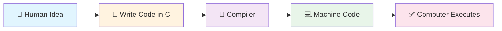

## What is C Language?

C is a programming language created in 1972 by Dennis Ritchie. Think of it as a **universal translator** between you and the computer.

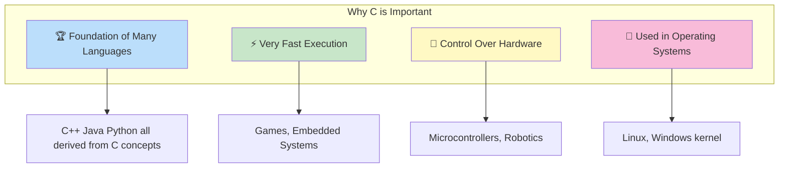

## Your First C Program

Let's write a simple program that displays "Hello, World!" on the screen:

```c
#include <stdio.h>

int main() {
    printf("Hello, World!");
    return 0;
}
```

### Let's Break Down Each Line:

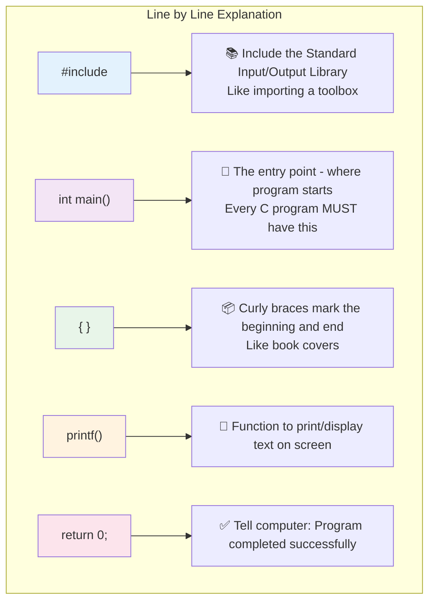

### Visual Flow of Program Execution:

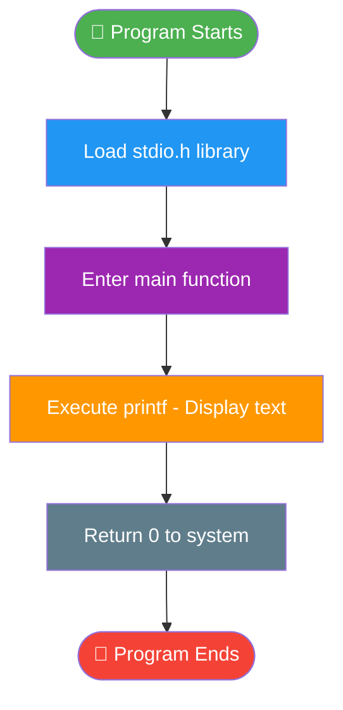

---

## Data Types

Data types tell the computer what kind of information you want to store. Just like in real life:
- A box for numbers
- A box for letters
- A box for decimal numbers

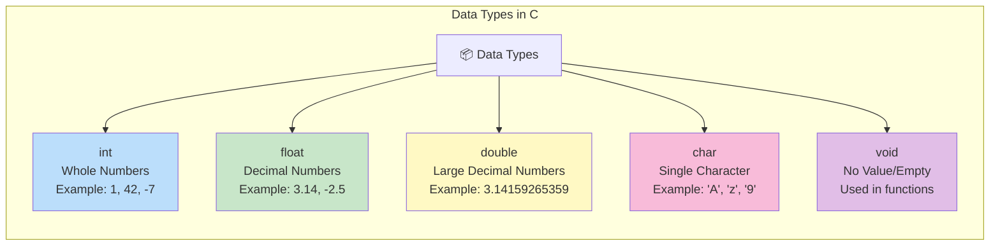

### Memory Size of Each Data Type:

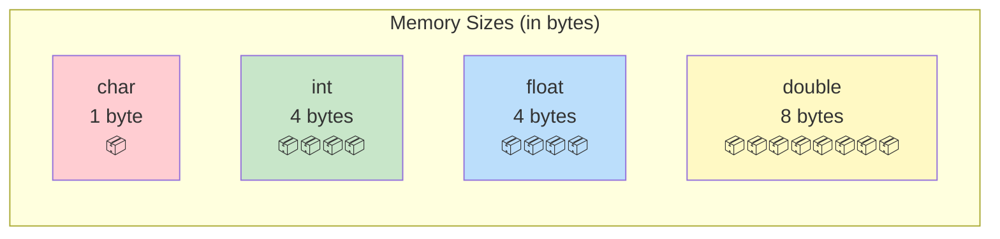

### Examples:

```c
int age = 25;           // Whole number
float price = 19.99;    // Decimal number
double pi = 3.14159265359;  // More precise decimal
char grade = 'A';       // Single character
```

---

## Variables & Constants

### What is a Variable?

A **variable** is like a labeled box where you can store and change values.

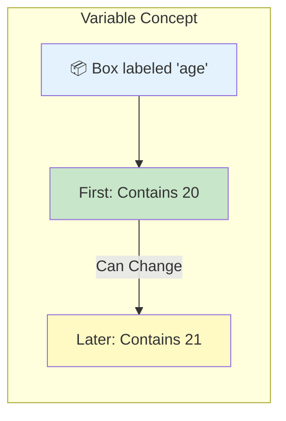

### Rules for Naming Variables:

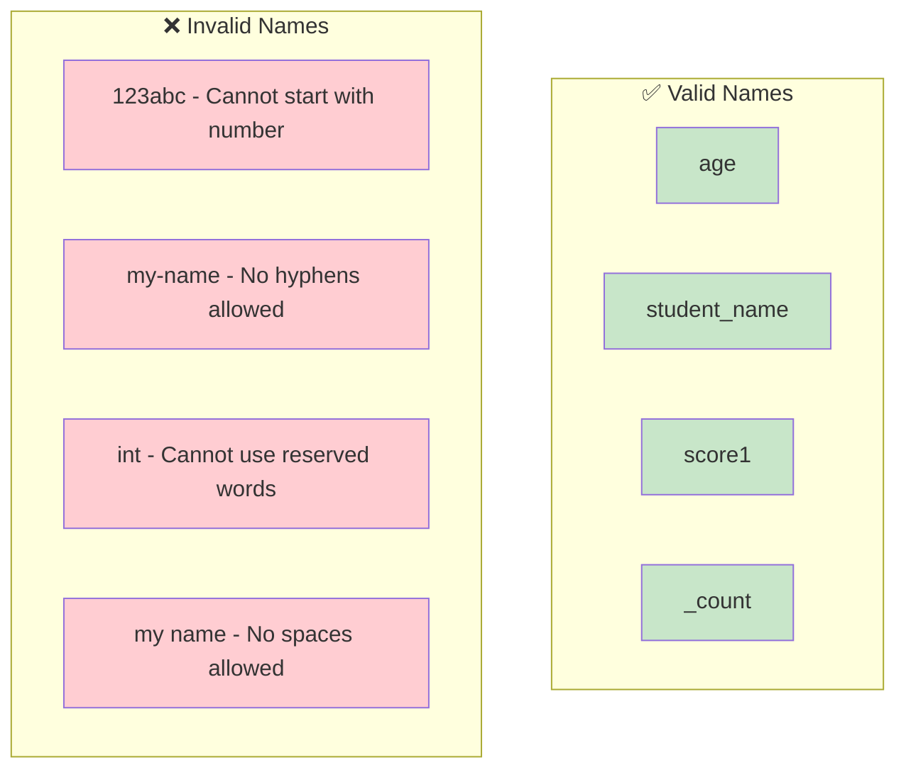

### Declaring Variables:

```c
// Declaration: Creating an empty box with a label
int age;

// Initialization: Putting a value in the box
age = 25;

// Declaration + Initialization together
int score = 100;
float temperature = 36.5;
char initial = 'S';
```

### What is a Constant?

A **constant** is like a sealed box - once you put a value, you cannot change it.

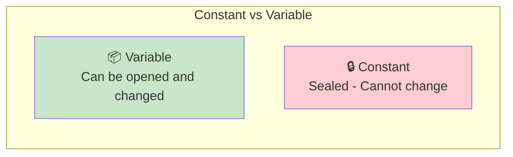

### Creating Constants:

```c
// Method 1: Using const keyword
const float PI = 3.14159;

// Method 2: Using #define (preprocessor)
#define MAX_SIZE 100

// Trying to change a constant will cause ERROR
PI = 3.14;  // ❌ ERROR! Cannot modify constant
```

---

## Operators

Operators are symbols that tell the computer to perform specific operations.

### Arithmetic Operators (Math Operations):

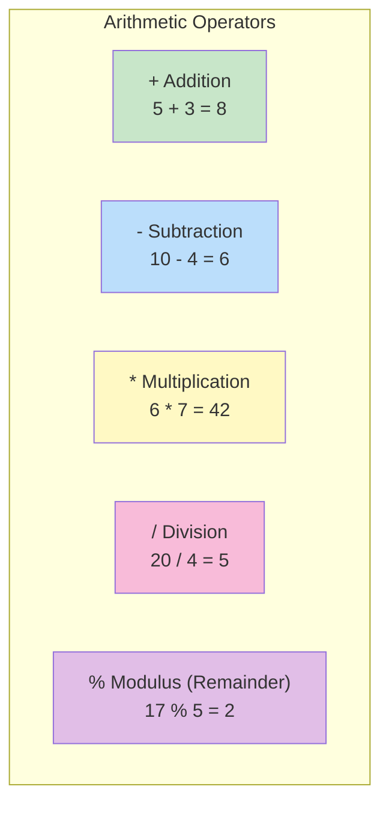

### Modulus Explained:

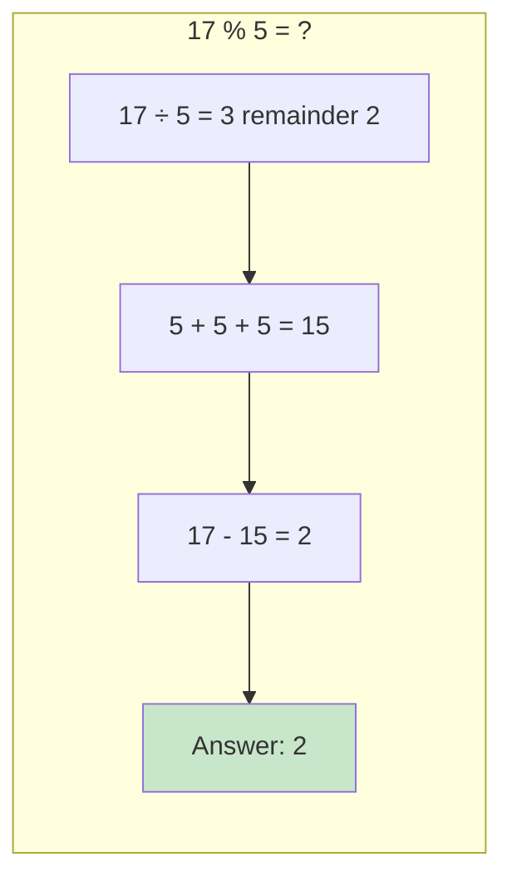

### Logical Operators (True/False decisions):

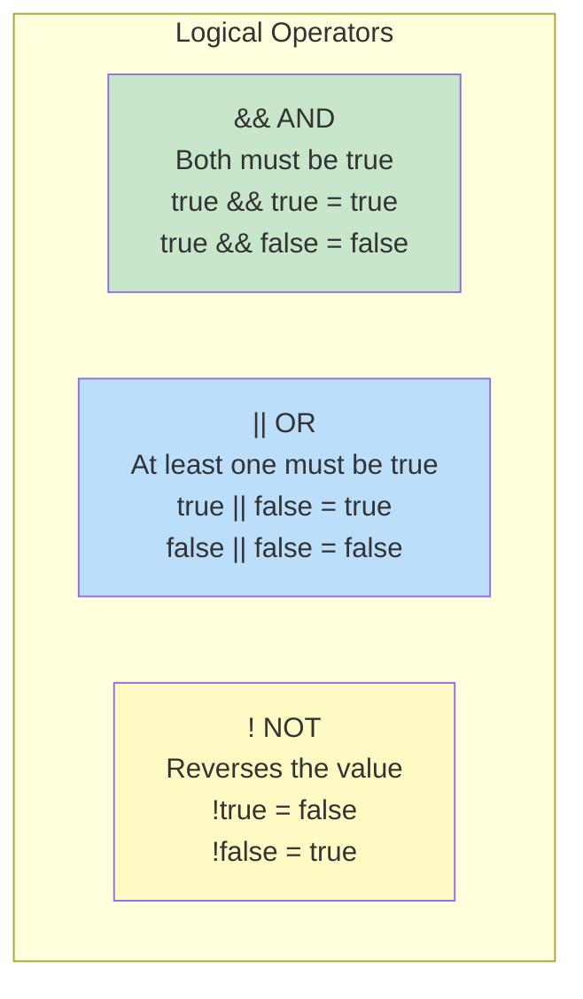

### AND Truth Table:

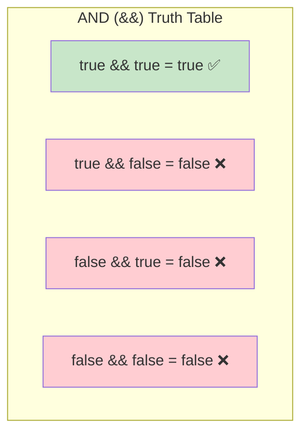

### OR Truth Table:

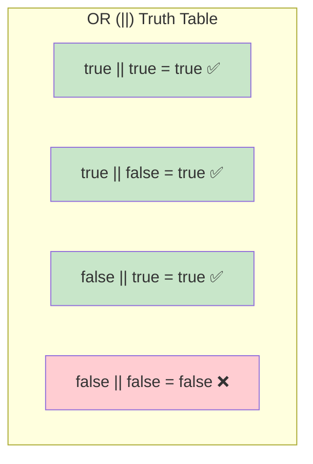

### Relational Operators (Comparison):

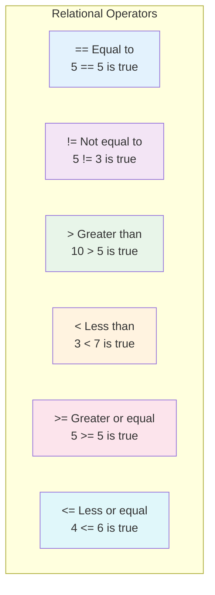

### Bitwise Operators:

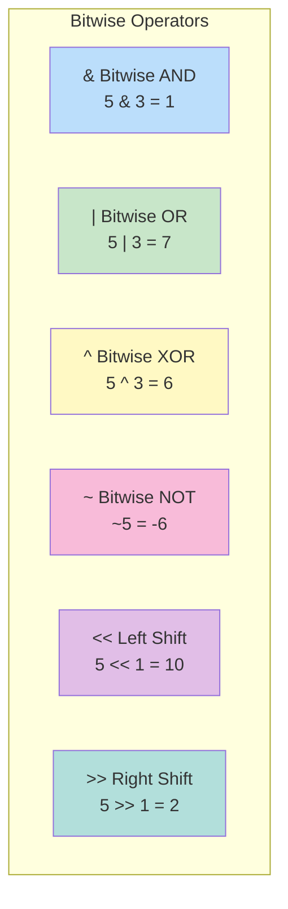

### Bitwise AND Explained (5 & 3):

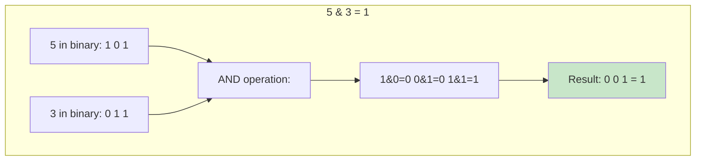

### Ternary Operator (Shortcut for if-else):

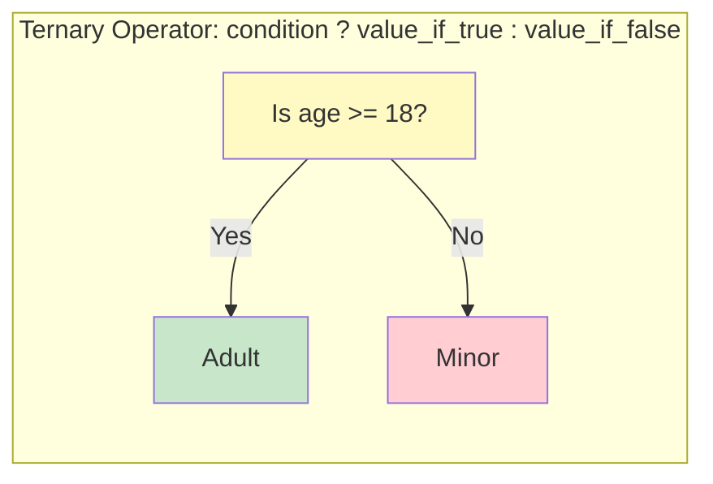

```c
int age = 20;
char* result = (age >= 18) ? "Adult" : "Minor";
// result = "Adult"
```

---

## Input/Output (printf and scanf)

### printf - Output (Displaying Text)

`printf` is used to display text and values on the screen.

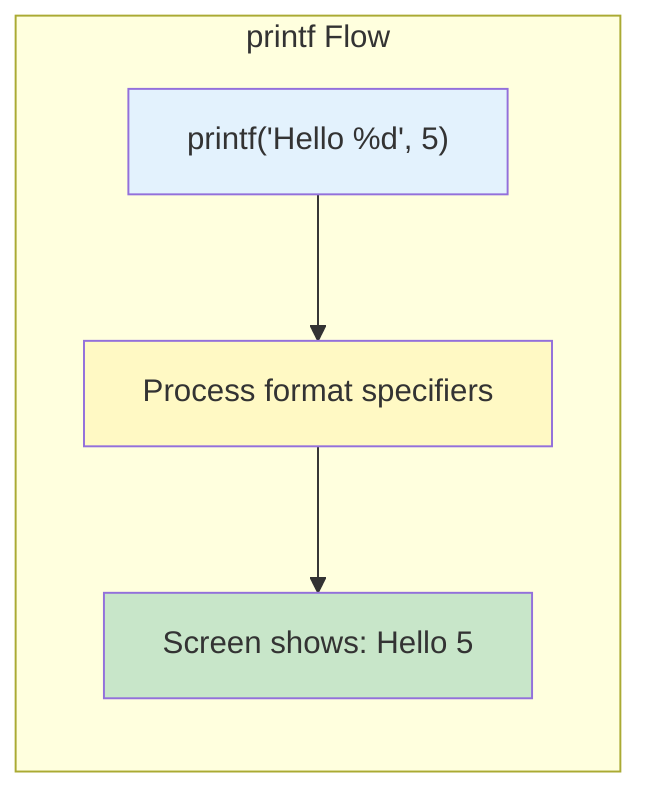

### Format Specifiers:

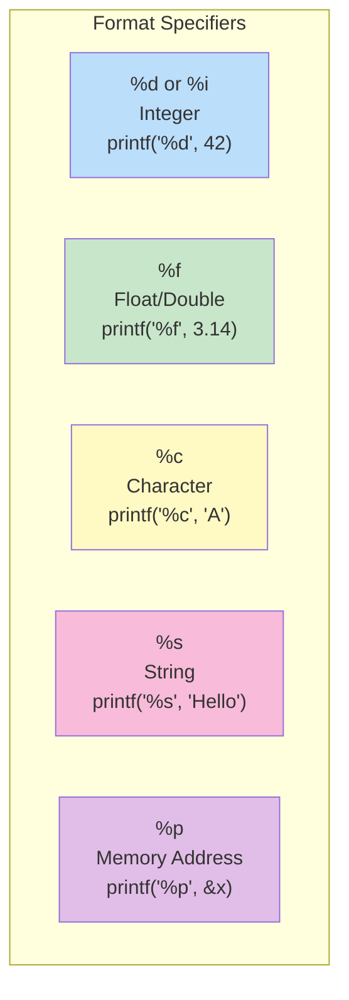

### Examples:

```c
int age = 25;
float height = 5.9;
char grade = 'A';

printf("Age: %d\n", age);           // Output: Age: 25
printf("Height: %.1f\n", height);   // Output: Height: 5.9
printf("Grade: %c\n", grade);       // Output: Grade: A
printf("Name: %s\n", "John");       // Output: Name: John
```

### scanf - Input (Getting Data from User)

`scanf` is used to get input from the user.

```mermaid
flowchart LR
    subgraph "scanf Flow"
        USER["User types: 25"] --> SCANF["scanf('%d', &age)"]
        SCANF --> STORE["Value 25 stored in variable 'age'"]
    end
    
    style USER fill:#e3f2fd
    style SCANF fill:#fff9c4
    style STORE fill:#c8e6c9
```

### Important: The & Symbol

```mermaid
flowchart TB
    subgraph "Why & in scanf?"
        A["& means 'address of'"]
        B["scanf needs to know WHERE to store the value"]
        C["&age gives the memory location of 'age' variable"]
        D["scanf puts the input value at that location"]
    end
    
    A --> B --> C --> D
    
    style A fill:#fff9c4
    style D fill:#c8e6c9
```

### Complete Input/Output Example:

```c
#include <stdio.h>

int main() {
    int age;
    float height;
    
    printf("Enter your age: ");
    scanf("%d", &age);
    
    printf("Enter your height: ");
    scanf("%f", &height);
    
    printf("You are %d years old and %.1f feet tall.\n", age, height);
    
    return 0;
}
```

---

## Control Flow

Control flow determines the order in which statements are executed.

### if-else Statements

```mermaid
flowchart TD
    START([Start]) --> COND{Is condition true?}
    COND -->|Yes| TRUE_BLOCK["Execute IF block"]
    COND -->|No| FALSE_BLOCK["Execute ELSE block"]
    TRUE_BLOCK --> END([End])
    FALSE_BLOCK --> END
    
    style START fill:#4caf50,color:#fff
    style END fill:#f44336,color:#fff
    style COND fill:#ffeb3b
    style TRUE_BLOCK fill:#c8e6c9
    style FALSE_BLOCK fill:#ffcdd2
```

### Example:

```c
int age = 20;

if (age >= 18) {
    printf("You can vote!");
} else {
    printf("You cannot vote yet.");
}
```

### if-else if-else Ladder:

```mermaid
flowchart TD
    START([Start]) --> C1{score >= 90?}
    C1 -->|Yes| A["Grade: A"]
    C1 -->|No| C2{score >= 80?}
    C2 -->|Yes| B["Grade: B"]
    C2 -->|No| C3{score >= 70?}
    C3 -->|Yes| C["Grade: C"]
    C3 -->|No| F["Grade: F"]
    
    A --> END([End])
    B --> END
    C --> END
    F --> END
    
    style START fill:#4caf50,color:#fff
    style END fill:#f44336,color:#fff
    style C1 fill:#fff9c4
    style C2 fill:#fff9c4
    style C3 fill:#fff9c4
    style A fill:#c8e6c9
    style B fill:#bbdefb
    style C fill:#e1bee7
    style F fill:#ffcdd2
```

```c
int score = 85;

if (score >= 90) {
    printf("Grade: A");
} else if (score >= 80) {
    printf("Grade: B");
} else if (score >= 70) {
    printf("Grade: C");
} else {
    printf("Grade: F");
}
```

### switch Statement

```mermaid
flowchart TD
    START([Start]) --> VAR["Read variable"]
    VAR --> SWITCH{Switch on variable}
    SWITCH -->|case 1| C1["Execute Case 1"]
    SWITCH -->|case 2| C2["Execute Case 2"]
    SWITCH -->|case 3| C3["Execute Case 3"]
    SWITCH -->|default| DEF["Execute Default"]
    
    C1 --> BREAK1[break]
    C2 --> BREAK2[break]
    C3 --> BREAK3[break]
    DEF --> END([End])
    BREAK1 --> END
    BREAK2 --> END
    BREAK3 --> END
    
    style START fill:#4caf50,color:#fff
    style END fill:#f44336,color:#fff
    style SWITCH fill:#fff9c4
```

```c
int day = 3;

switch(day) {
    case 1:
        printf("Monday");
        break;
    case 2:
        printf("Tuesday");
        break;
    case 3:
        printf("Wednesday");
        break;
    default:
        printf("Other day");
}
```

### Why break is Important:

```mermaid
flowchart LR
    subgraph "Without break - FALL THROUGH"
        A["case 1: executes"] --> B["case 2: executes"] --> C["case 3: executes"]
    end
    
    subgraph "With break - STOPS"
        D["case 1: executes"] --> E["break;"] --> F["Exit switch"]
    end
    
    style A fill:#ffcdd2
    style B fill:#ffcdd2
    style C fill:#ffcdd2
    style D fill:#c8e6c9
    style E fill:#fff9c4
    style F fill:#c8e6c9
```

---

## Loops

Loops are used to repeat a block of code multiple times.

### for Loop

```mermaid
flowchart TD
    START([Start]) --> INIT["Initialize counter<br/>i = 0"]
    INIT --> COND{Is i < 5?}
    COND -->|Yes| BODY["Execute loop body<br/>print i"]
    BODY --> UPDATE["Update counter<br/>i++"]
    UPDATE --> COND
    COND -->|No| END([End Loop])
    
    style START fill:#4caf50,color:#fff
    style END fill:#f44336,color:#fff
    style INIT fill:#bbdefb
    style COND fill:#fff9c4
    style BODY fill:#c8e6c9
    style UPDATE fill:#f8bbd9
```

```c
// Print numbers 0 to 4
for (int i = 0; i < 5; i++) {
    printf("%d ", i);
}
// Output: 0 1 2 3 4
```

### for Loop Components:

```mermaid
flowchart LR
    subgraph "for (int i = 0; i < 5; i++)"
        INIT["int i = 0<br/>INITIALIZATION<br/>Run once at start"]
        COND["i < 5<br/>CONDITION<br/>Check before each iteration"]
        UPDATE["i++<br/>UPDATE<br/>Run after each iteration"]
    end
    
    INIT --> COND --> UPDATE
    
    style INIT fill:#bbdefb
    style COND fill:#fff9c4
    style UPDATE fill:#f8bbd9
```

### while Loop

```mermaid
flowchart TD
    START([Start]) --> INIT["Initialize<br/>i = 0"]
    INIT --> COND{Is i < 5?}
    COND -->|Yes| BODY["Execute body<br/>print i<br/>i++"]
    BODY --> COND
    COND -->|No| END([End])
    
    style START fill:#4caf50,color:#fff
    style END fill:#f44336,color:#fff
    style COND fill:#fff9c4
    style BODY fill:#c8e6c9
```

```c
int i = 0;
while (i < 5) {
    printf("%d ", i);
    i++;
}
// Output: 0 1 2 3 4
```

### do-while Loop

The key difference: **Executes at least once** before checking condition.

```mermaid
flowchart TD
    START([Start]) --> INIT["Initialize<br/>i = 0"]
    INIT --> BODY["Execute body<br/>print i<br/>i++"]
    BODY --> COND{Is i < 5?}
    COND -->|Yes| BODY
    COND -->|No| END([End])
    
    style START fill:#4caf50,color:#fff
    style END fill:#f44336,color:#fff
    style COND fill:#fff9c4
    style BODY fill:#c8e6c9
```

```c
int i = 0;
do {
    printf("%d ", i);
    i++;
} while (i < 5);
// Output: 0 1 2 3 4
```

### Comparison of Loops:

```mermaid
flowchart TB
    subgraph "Loop Comparison"
        FOR["FOR Loop<br/>✓ Know exact count<br/>✓ Counter built-in"]
        WHILE["WHILE Loop<br/>✓ Unknown count<br/>✓ Check before execute"]
        DOWHILE["DO-WHILE Loop<br/>✓ Execute at least once<br/>✓ Check after execute"]
    end
    
    style FOR fill:#bbdefb
    style WHILE fill:#c8e6c9
    style DOWHILE fill:#fff9c4
```

### Loop Control Statements:

```mermaid
flowchart TB
    subgraph "Loop Control"
        BREAK["break<br/>Exit loop immediately"]
        CONTINUE["continue<br/>Skip to next iteration"]
    end
    
    style BREAK fill:#ffcdd2
    style CONTINUE fill:#fff9c4
```

```c
// break example
for (int i = 0; i < 10; i++) {
    if (i == 5) break;  // Stop when i is 5
    printf("%d ", i);
}
// Output: 0 1 2 3 4

// continue example
for (int i = 0; i < 10; i++) {
    if (i == 5) continue;  // Skip 5
    printf("%d ", i);
}
// Output: 0 1 2 3 4 6 7 8 9
```

---

## 👉 Practice Problems for Core Basics

### 1. Check if Number is Prime

```mermaid
flowchart TD
    START([Start]) --> INPUT["Input number n"]
    INPUT --> CHECK1{n <= 1?}
    CHECK1 -->|Yes| NOT_PRIME["Not Prime"]
    CHECK1 -->|No| LOOP["Check divisibility from 2 to sqrt(n)"]
    LOOP --> DIVISIBLE{Found a divisor?}
    DIVISIBLE -->|Yes| NOT_PRIME
    DIVISIBLE -->|No| PRIME["Prime!"]
    NOT_PRIME --> END([End])
    PRIME --> END
    
    style START fill:#4caf50,color:#fff
    style END fill:#f44336,color:#fff
    style PRIME fill:#c8e6c9
    style NOT_PRIME fill:#ffcdd2
```

```c
#include <stdio.h>

int main() {
    int n, isPrime = 1;
    printf("Enter a number: ");
    scanf("%d", &n);
    
    if (n <= 1) {
        isPrime = 0;
    } else {
        for (int i = 2; i * i <= n; i++) {
            if (n % i == 0) {
                isPrime = 0;
                break;
            }
        }
    }
    
    if (isPrime)
        printf("%d is Prime", n);
    else
        printf("%d is Not Prime", n);
    
    return 0;
}
```

### 2. Check if Number is Palindrome

```mermaid
flowchart TD
    START([Start]) --> INPUT["Input: 121"]
    INPUT --> REVERSE["Reverse the number"]
    REVERSE --> R1["121 → get 1 → reversed = 1"]
    R1 --> R2["12 → get 2 → reversed = 12"]
    R2 --> R3["1 → get 1 → reversed = 121"]
    R3 --> COMPARE{Original == Reversed?}
    COMPARE -->|Yes| PALINDROME["Palindrome!"]
    COMPARE -->|No| NOT_PALINDROME["Not Palindrome"]
    
    style START fill:#4caf50,color:#fff
    style PALINDROME fill:#c8e6c9
    style NOT_PALINDROME fill:#ffcdd2
```

```c
#include <stdio.h>

int main() {
    int n, original, reversed = 0, remainder;
    
    printf("Enter a number: ");
    scanf("%d", &n);
    original = n;
    
    while (n != 0) {
        remainder = n % 10;
        reversed = reversed * 10 + remainder;
        n /= 10;
    }
    
    if (original == reversed)
        printf("Palindrome");
    else
        printf("Not Palindrome");
    
    return 0;
}
```

### 3. Calculate Factorial

```mermaid
flowchart TD
    START([Start]) --> INPUT["Input: 5"]
    INPUT --> INIT["fact = 1"]
    INIT --> LOOP["Multiply 1 × 2 × 3 × 4 × 5"]
    LOOP --> RESULT["Result: 120"]
    
    subgraph "Step by Step"
        S1["1 × 1 = 1"]
        S2["1 × 2 = 2"]
        S3["2 × 3 = 6"]
        S4["6 × 4 = 24"]
        S5["24 × 5 = 120"]
    end
    
    style START fill:#4caf50,color:#fff
    style RESULT fill:#c8e6c9
```

```c
#include <stdio.h>

int main() {
    int n;
    long long factorial = 1;
    
    printf("Enter a number: ");
    scanf("%d", &n);
    
    for (int i = 1; i <= n; i++) {
        factorial *= i;
    }
    
    printf("Factorial of %d = %lld", n, factorial);
    
    return 0;
}
```

---

# 🔁 2. Functions

## What is a Function?

A function is a **reusable block of code** that performs a specific task. Think of it like a vending machine:
- You give input (money + selection)
- It processes internally
- It gives output (snack)

```mermaid
flowchart LR
    subgraph "Function Concept"
        INPUT["📥 Input<br/>(Parameters)"] --> PROCESS["⚙️ Processing<br/>(Function Body)"]
        PROCESS --> OUTPUT["📤 Output<br/>(Return Value)"]
    end
    
    style INPUT fill:#bbdefb
    style PROCESS fill:#fff9c4
    style OUTPUT fill:#c8e6c9
```

## Why Use Functions?

```mermaid
flowchart TB
    subgraph "Benefits of Functions"
        A["🔄 Reusability<br/>Write once, use many times"]
        B["📦 Modularity<br/>Break complex problems into smaller parts"]
        C["🧪 Easy Testing<br/>Test each function separately"]
        D["📖 Readability<br/>Code is easier to understand"]
    end
    
    style A fill:#c8e6c9
    style B fill:#bbdefb
    style C fill:#fff9c4
    style D fill:#f8bbd9
```

## Function Structure

```mermaid
flowchart TB
    subgraph "Function Anatomy"
        RETURN["Return Type<br/>int, float, void, etc."]
        NAME["Function Name<br/>add, calculate, etc."]
        PARAMS["Parameters<br/>(int a, int b)"]
        BODY["Function Body<br/>{...code...}"]
        RET["Return Statement<br/>return result;"]
    end
    
    RETURN --> NAME --> PARAMS --> BODY --> RET
    
    style RETURN fill:#bbdefb
    style NAME fill:#c8e6c9
    style PARAMS fill:#fff9c4
    style BODY fill:#f8bbd9
    style RET fill:#e1bee7
```

### Basic Function Example:

```c
// Function Declaration (tells compiler the function exists)
int add(int a, int b);

// Function Definition (actual implementation)
int add(int a, int b) {
    int sum = a + b;
    return sum;
}

// Function Call (using the function)
int main() {
    int result = add(5, 3);  // result = 8
    printf("Sum: %d", result);
    return 0;
}
```

## Declaration vs Definition

```mermaid
flowchart TB
    subgraph "Declaration (Prototype)"
        D1["int add(int a, int b);"]
        D2["Just tells compiler:<br/>'This function exists'"]
        D3["Usually at top of file<br/>or in header files"]
    end
    
    subgraph "Definition"
        DEF1["int add(int a, int b) {<br/>    return a + b;<br/>}"]
        DEF2["Actual implementation<br/>with the code"]
    end
    
    style D1 fill:#bbdefb
    style DEF1 fill:#c8e6c9
```

## Call by Value vs Call by Reference

This is a **very important concept** for interviews!

### Call by Value

```mermaid
flowchart TB
    subgraph "Call by Value"
        A["Original: a = 5"]
        B["Function receives COPY"]
        C["Copy modified inside function"]
        D["Original unchanged: a = 5"]
    end
    
    A --> B --> C --> D
    
    style A fill:#bbdefb
    style B fill:#fff9c4
    style C fill:#f8bbd9
    style D fill:#bbdefb
```

```c
void changeValue(int x) {
    x = 100;  // Only changes the copy
}

int main() {
    int a = 5;
    changeValue(a);
    printf("%d", a);  // Output: 5 (unchanged!)
    return 0;
}
```

### Call by Reference (Using Pointers)

```mermaid
flowchart TB
    subgraph "Call by Reference"
        A["Original: a = 5<br/>Address: 0x100"]
        B["Function receives ADDRESS"]
        C["Modifies value at that address"]
        D["Original changed: a = 100"]
    end
    
    A --> B --> C --> D
    
    style A fill:#bbdefb
    style B fill:#fff9c4
    style C fill:#f8bbd9
    style D fill:#c8e6c9
```

```c
void changeValue(int *x) {
    *x = 100;  // Changes value at the address
}

int main() {
    int a = 5;
    changeValue(&a);  // Pass address
    printf("%d", a);  // Output: 100 (changed!)
    return 0;
}
```

### Visual Comparison:

```mermaid
flowchart LR
    subgraph "Call by Value"
        V1["📦 Box A<br/>Value: 5"]
        V2["📦 Copy of A<br/>Value: 5→100"]
        V3["📦 Box A<br/>Still 5"]
    end
    
    subgraph "Call by Reference"
        R1["📦 Box A<br/>Address: 0x100<br/>Value: 5"]
        R2["📍 Pointing to A<br/>Change at 0x100"]
        R3["📦 Box A<br/>Now: 100"]
    end
    
    V1 --> V2 --> V3
    R1 --> R2 --> R3
    
    style V3 fill:#ffcdd2
    style R3 fill:#c8e6c9
```

---

## Recursion

Recursion is when a **function calls itself**.

```mermaid
flowchart TD
    subgraph "Recursion Concept"
        A["Function calls itself"]
        B["Each call: smaller problem"]
        C["Base case: stops recursion"]
        D["Results combine back up"]
    end
    
    A --> B --> C --> D
    
    style A fill:#bbdefb
    style B fill:#fff9c4
    style C fill:#c8e6c9
    style D fill:#f8bbd9
```

### Factorial using Recursion

```mermaid
flowchart TD
    subgraph "factorial(5)"
        F5["factorial(5)"] --> M5["5 × factorial(4)"]
        M5 --> F4["factorial(4)"]
        F4 --> M4["4 × factorial(3)"]
        M4 --> F3["factorial(3)"]
        F3 --> M3["3 × factorial(2)"]
        M3 --> F2["factorial(2)"]
        F2 --> M2["2 × factorial(1)"]
        M2 --> F1["factorial(1)"]
        F1 --> BASE["Base case: return 1"]
    end
    
    style F5 fill:#bbdefb
    style F4 fill:#c8e6c9
    style F3 fill:#fff9c4
    style F2 fill:#f8bbd9
    style F1 fill:#e1bee7
    style BASE fill:#ffcdd2
```

### Return Journey:

```mermaid
flowchart BT
    BASE["factorial(1) = 1"] --> R2["factorial(2) = 2 × 1 = 2"]
    R2 --> R3["factorial(3) = 3 × 2 = 6"]
    R3 --> R4["factorial(4) = 4 × 6 = 24"]
    R4 --> R5["factorial(5) = 5 × 24 = 120"]
    
    style BASE fill:#ffcdd2
    style R2 fill:#e1bee7
    style R3 fill:#fff9c4
    style R4 fill:#c8e6c9
    style R5 fill:#bbdefb
```

```c
int factorial(int n) {
    // Base case - stops recursion
    if (n <= 1) {
        return 1;
    }
    // Recursive case - function calls itself
    return n * factorial(n - 1);
}

int main() {
    printf("%d", factorial(5));  // Output: 120
    return 0;
}
```

### Fibonacci using Recursion

```mermaid
flowchart TD
    subgraph "Fibonacci Sequence: 0, 1, 1, 2, 3, 5, 8, 13..."
        A["Each number = sum of previous two"]
        B["fib(0) = 0"]
        C["fib(1) = 1"]
        D["fib(n) = fib(n-1) + fib(n-2)"]
    end
    
    style B fill:#c8e6c9
    style C fill:#c8e6c9
    style D fill:#fff9c4
```

```mermaid
flowchart TD
    FIB5["fib(5)"] --> FIB4["fib(4)"]
    FIB5 --> FIB3A["fib(3)"]
    
    FIB4 --> FIB3B["fib(3)"]
    FIB4 --> FIB2A["fib(2)"]
    
    FIB3A --> FIB2B["fib(2)"]
    FIB3A --> FIB1A["fib(1)=1"]
    
    FIB3B --> FIB2C["fib(2)"]
    FIB3B --> FIB1B["fib(1)=1"]
    
    FIB2A --> FIB1C["fib(1)=1"]
    FIB2A --> FIB0A["fib(0)=0"]
    
    style FIB5 fill:#bbdefb
    style FIB1A fill:#c8e6c9
    style FIB1B fill:#c8e6c9
    style FIB1C fill:#c8e6c9
    style FIB0A fill:#c8e6c9
```

```c
int fibonacci(int n) {
    // Base cases
    if (n == 0) return 0;
    if (n == 1) return 1;
    
    // Recursive case
    return fibonacci(n - 1) + fibonacci(n - 2);
}

int main() {
    for (int i = 0; i < 10; i++) {
        printf("%d ", fibonacci(i));
    }
    // Output: 0 1 1 2 3 5 8 13 21 34
    return 0;
}
```

### Recursion vs Iteration:

```mermaid
flowchart TB
    subgraph "Recursion"
        R1["✓ Elegant, clean code"]
        R2["✓ Natural for tree/graph problems"]
        R3["✗ More memory (stack frames)"]
        R4["✗ Can be slower"]
    end
    
    subgraph "Iteration"
        I1["✓ Less memory usage"]
        I2["✓ Usually faster"]
        I3["✗ Can be harder to write"]
        I4["✗ Less elegant for some problems"]
    end
    
    style R1 fill:#c8e6c9
    style R2 fill:#c8e6c9
    style R3 fill:#ffcdd2
    style R4 fill:#ffcdd2
    style I1 fill:#c8e6c9
    style I2 fill:#c8e6c9
    style I3 fill:#ffcdd2
    style I4 fill:#ffcdd2
```

---

# 📦 3. Arrays & Strings

## What is an Array?

An array is like a **row of boxes** where each box can hold a value of the same type.

```mermaid
flowchart LR
    subgraph "Array: int numbers[5]"
        B0["[0]<br/>10"]
        B1["[1]<br/>20"]
        B2["[2]<br/>30"]
        B3["[3]<br/>40"]
        B4["[4]<br/>50"]
    end
    
    style B0 fill:#bbdefb
    style B1 fill:#c8e6c9
    style B2 fill:#fff9c4
    style B3 fill:#f8bbd9
    style B4 fill:#e1bee7
```

### Key Points:

```mermaid
flowchart TB
    subgraph "Array Facts"
        A["📍 Index starts at 0, not 1"]
        B["📦 All elements same data type"]
        C["📏 Fixed size once created"]
        D["🔢 Stored in contiguous memory"]
    end
    
    style A fill:#fff9c4
    style B fill:#bbdefb
    style C fill:#f8bbd9
    style D fill:#c8e6c9
```

### Array Declaration and Initialization:

```c
// Declaration only (values are garbage)
int numbers[5];

// Declaration with initialization
int numbers[5] = {10, 20, 30, 40, 50};

// Partial initialization (rest become 0)
int numbers[5] = {10, 20};  // {10, 20, 0, 0, 0}

// Let compiler count size
int numbers[] = {10, 20, 30};  // Size is 3
```

### Memory Layout:

```mermaid
flowchart TB
    subgraph "Memory: int arr[5] = {10, 20, 30, 40, 50}"
        direction LR
        M1["Address: 1000<br/>arr[0] = 10"]
        M2["Address: 1004<br/>arr[1] = 20"]
        M3["Address: 1008<br/>arr[2] = 30"]
        M4["Address: 1012<br/>arr[3] = 40"]
        M5["Address: 1016<br/>arr[4] = 50"]
    end
    
    M1 --> M2 --> M3 --> M4 --> M5
    
    style M1 fill:#bbdefb
    style M2 fill:#c8e6c9
    style M3 fill:#fff9c4
    style M4 fill:#f8bbd9
    style M5 fill:#e1bee7
```

Note: Each `int` takes 4 bytes, so addresses increase by 4.

---

## 2D Arrays (Matrix)

A 2D array is like a **table with rows and columns**.

```mermaid
flowchart TB
    subgraph "2D Array: int matrix[3][4]"
        direction TB
        subgraph "Row 0"
            R0C0["[0][0]"]
            R0C1["[0][1]"]
            R0C2["[0][2]"]
            R0C3["[0][3]"]
        end
        subgraph "Row 1"
            R1C0["[1][0]"]
            R1C1["[1][1]"]
            R1C2["[1][2]"]
            R1C3["[1][3]"]
        end
        subgraph "Row 2"
            R2C0["[2][0]"]
            R2C1["[2][1]"]
            R2C2["[2][2]"]
            R2C3["[2][3]"]
        end
    end
    
    style R0C0 fill:#bbdefb
    style R1C1 fill:#c8e6c9
    style R2C2 fill:#fff9c4
```

```c
// Declaration
int matrix[3][4];  // 3 rows, 4 columns

// Initialization
int matrix[3][4] = {
    {1, 2, 3, 4},
    {5, 6, 7, 8},
    {9, 10, 11, 12}
};

// Accessing elements
printf("%d", matrix[1][2]);  // Output: 7
```

### Iterating 2D Array:

```c
for (int i = 0; i < 3; i++) {       // rows
    for (int j = 0; j < 4; j++) {   // columns
        printf("%d ", matrix[i][j]);
    }
    printf("\n");
}
```

---

## Passing Arrays to Functions

Arrays are always passed by reference (actually by pointer).

```mermaid
flowchart LR
    subgraph "Array Passed to Function"
        MAIN["main()<br/>int arr[5] = {...}"]
        FUNC["processArray(int arr[], int size)"]
        SAME["Both point to SAME memory"]
    end
    
    MAIN -->|"Passes address"| FUNC
    FUNC --> SAME
    
    style MAIN fill:#bbdefb
    style FUNC fill:#c8e6c9
    style SAME fill:#fff9c4
```

```c
void printArray(int arr[], int size) {
    for (int i = 0; i < size; i++) {
        printf("%d ", arr[i]);
    }
}

void modifyArray(int arr[], int size) {
    for (int i = 0; i < size; i++) {
        arr[i] *= 2;  // This DOES modify original!
    }
}

int main() {
    int numbers[] = {1, 2, 3, 4, 5};
    int size = sizeof(numbers) / sizeof(numbers[0]);
    
    printArray(numbers, size);   // 1 2 3 4 5
    modifyArray(numbers, size);
    printArray(numbers, size);   // 2 4 6 8 10 (modified!)
    
    return 0;
}
```

---

## Searching Algorithms

### Linear Search:

```mermaid
flowchart LR
    subgraph "Linear Search: Find 30"
        A["10"] -->|"Not 30"| B["20"]
        B -->|"Not 30"| C["30"]
        C -->|"Found!"| DONE["Return index 2"]
    end
    
    style A fill:#ffcdd2
    style B fill:#ffcdd2
    style C fill:#c8e6c9
    style DONE fill:#4caf50,color:#fff
```

```c
int linearSearch(int arr[], int size, int target) {
    for (int i = 0; i < size; i++) {
        if (arr[i] == target) {
            return i;  // Found! Return index
        }
    }
    return -1;  // Not found
}
```

### Binary Search (Array must be sorted!):

```mermaid
flowchart TD
    subgraph "Binary Search: Find 23 in [2, 5, 8, 12, 16, 23, 38, 56, 72, 91]"
        S1["low=0, high=9, mid=4<br/>arr[4]=16<br/>16 < 23, search right"]
        S2["low=5, high=9, mid=7<br/>arr[7]=56<br/>56 > 23, search left"]
        S3["low=5, high=6, mid=5<br/>arr[5]=23<br/>FOUND at index 5!"]
    end
    
    S1 --> S2 --> S3
    
    style S1 fill:#bbdefb
    style S2 fill:#fff9c4
    style S3 fill:#c8e6c9
```

```c
int binarySearch(int arr[], int size, int target) {
    int low = 0, high = size - 1;
    
    while (low <= high) {
        int mid = (low + high) / 2;
        
        if (arr[mid] == target) {
            return mid;  // Found!
        } else if (arr[mid] < target) {
            low = mid + 1;  // Search right half
        } else {
            high = mid - 1; // Search left half
        }
    }
    return -1;  // Not found
}
```

### Comparison:

```mermaid
flowchart TB
    subgraph "Linear vs Binary Search"
        LINEAR["Linear Search<br/>• Any array (sorted or not)<br/>• Time: O(n)<br/>• Simple"]
        BINARY["Binary Search<br/>• MUST be sorted<br/>• Time: O(log n)<br/>• Much faster for large arrays"]
    end
    
    style LINEAR fill:#ffcdd2
    style BINARY fill:#c8e6c9
```

---

## Sorting Algorithms

### Bubble Sort

```mermaid
flowchart TB
    subgraph "Bubble Sort: [5, 3, 8, 1, 2]"
        P1["Pass 1: Compare adjacent pairs, swap if needed"]
        P2["[3, 5, 1, 2, 8] - 8 bubbled to end"]
        P3["Pass 2: [3, 1, 2, 5, 8] - 5 bubbled"]
        P4["Pass 3: [1, 2, 3, 5, 8] - 3 bubbled"]
        P5["Sorted!"]
    end
    
    P1 --> P2 --> P3 --> P4 --> P5
    
    style P5 fill:#c8e6c9
```

```c
void bubbleSort(int arr[], int n) {
    for (int i = 0; i < n - 1; i++) {
        for (int j = 0; j < n - i - 1; j++) {
            if (arr[j] > arr[j + 1]) {
                // Swap
                int temp = arr[j];
                arr[j] = arr[j + 1];
                arr[j + 1] = temp;
            }
        }
    }
}
```

### Selection Sort

```mermaid
flowchart TB
    subgraph "Selection Sort: [64, 25, 12, 22, 11]"
        S1["Find minimum (11), swap with first position"]
        R1["[11, 25, 12, 22, 64]"]
        S2["Find minimum in remaining (12), swap"]
        R2["[11, 12, 25, 22, 64]"]
        S3["Find minimum in remaining (22), swap"]
        R3["[11, 12, 22, 25, 64]"]
        S4["Sorted!"]
    end
    
    S1 --> R1 --> S2 --> R2 --> S3 --> R3 --> S4
    
    style S4 fill:#c8e6c9
```

```c
void selectionSort(int arr[], int n) {
    for (int i = 0; i < n - 1; i++) {
        int minIdx = i;
        for (int j = i + 1; j < n; j++) {
            if (arr[j] < arr[minIdx]) {
                minIdx = j;
            }
        }
        // Swap
        int temp = arr[minIdx];
        arr[minIdx] = arr[i];
        arr[i] = temp;
    }
}
```

### Insertion Sort

```mermaid
flowchart TB
    subgraph "Insertion Sort: [5, 2, 4, 6, 1, 3]"
        I1["Start with 5 (sorted portion: [5])"]
        I2["Insert 2: [2, 5]"]
        I3["Insert 4: [2, 4, 5]"]
        I4["Insert 6: [2, 4, 5, 6]"]
        I5["Insert 1: [1, 2, 4, 5, 6]"]
        I6["Insert 3: [1, 2, 3, 4, 5, 6]"]
    end
    
    I1 --> I2 --> I3 --> I4 --> I5 --> I6
    
    style I6 fill:#c8e6c9
```

```c
void insertionSort(int arr[], int n) {
    for (int i = 1; i < n; i++) {
        int key = arr[i];
        int j = i - 1;
        
        // Move elements greater than key one position ahead
        while (j >= 0 && arr[j] > key) {
            arr[j + 1] = arr[j];
            j--;
        }
        arr[j + 1] = key;
    }
}
```

---

## Strings in C

A string is an **array of characters** ending with a null character `\0`.

```mermaid
flowchart LR
    subgraph "String: 'Hello'"
        C0["[0]<br/>'H'"]
        C1["[1]<br/>'e'"]
        C2["[2]<br/>'l'"]
        C3["[3]<br/>'l'"]
        C4["[4]<br/>'o'"]
        C5["[5]<br/>'\0'"]
    end
    
    C0 --> C1 --> C2 --> C3 --> C4 --> C5
    
    style C0 fill:#bbdefb
    style C1 fill:#c8e6c9
    style C2 fill:#fff9c4
    style C3 fill:#fff9c4
    style C4 fill:#f8bbd9
    style C5 fill:#ffcdd2
```

### String Declaration:

```c
// Method 1: Character array
char str1[6] = {'H', 'e', 'l', 'l', 'o', '\0'};

// Method 2: String literal (easier)
char str2[] = "Hello";  // \0 is added automatically

// Method 3: Pointer to string
char *str3 = "Hello";
```

### Important String Functions:

```mermaid
flowchart TB
    subgraph "String Functions <string.h>"
        STRLEN["strlen(str)<br/>Returns length<br/>strlen('Hello') = 5"]
        STRCPY["strcpy(dest, src)<br/>Copies string<br/>strcpy(dest, 'Hi')"]
        STRCAT["strcat(dest, src)<br/>Concatenates<br/>strcat('Hello', ' World')"]
        STRCMP["strcmp(s1, s2)<br/>Compares strings<br/>Returns 0 if equal"]
    end
    
    style STRLEN fill:#bbdefb
    style STRCPY fill:#c8e6c9
    style STRCAT fill:#fff9c4
    style STRCMP fill:#f8bbd9
```

```c
#include <stdio.h>
#include <string.h>

int main() {
    char str1[] = "Hello";
    char str2[20];
    char str3[] = "World";
    
    // Length
    printf("Length: %lu\n", strlen(str1));  // 5
    
    // Copy
    strcpy(str2, str1);
    printf("Copied: %s\n", str2);  // Hello
    
    // Concatenate
    strcat(str2, " ");
    strcat(str2, str3);
    printf("Concatenated: %s\n", str2);  // Hello World
    
    // Compare
    if (strcmp(str1, "Hello") == 0) {
        printf("Strings are equal\n");
    }
    
    return 0;
}
```

### Manual String Operations:

```c
// Manual strlen
int myStrlen(char *str) {
    int len = 0;
    while (str[len] != '\0') {
        len++;
    }
    return len;
}

// Manual strcpy
void myStrcpy(char *dest, char *src) {
    int i = 0;
    while (src[i] != '\0') {
        dest[i] = src[i];
        i++;
    }
    dest[i] = '\0';
}

// Reverse string
void reverseString(char *str) {
    int len = strlen(str);
    for (int i = 0; i < len / 2; i++) {
        char temp = str[i];
        str[i] = str[len - 1 - i];
        str[len - 1 - i] = temp;
    }
}
```

---

## 👉 String Practice Problems

### Check Anagram:

```mermaid
flowchart TD
    subgraph "Anagram Check: 'listen' and 'silent'"
        A["Count letters in 'listen':<br/>e:1, i:1, l:1, n:1, s:1, t:1"]
        B["Count letters in 'silent':<br/>e:1, i:1, l:1, n:1, s:1, t:1"]
        C["Same counts = ANAGRAM!"]
    end
    
    A --> C
    B --> C
    
    style C fill:#c8e6c9
```

```c
#include <stdio.h>
#include <string.h>

int areAnagrams(char *str1, char *str2) {
    int count[256] = {0};  // For all ASCII characters
    
    if (strlen(str1) != strlen(str2)) return 0;
    
    for (int i = 0; str1[i] != '\0'; i++) {
        count[(int)str1[i]]++;
        count[(int)str2[i]]--;
    }
    
    for (int i = 0; i < 256; i++) {
        if (count[i] != 0) return 0;
    }
    
    return 1;
}
```

---

# 📍 4. Pointers (CRITICAL TOPIC)

## What is a Pointer?

A pointer is a variable that **stores a memory address**.

```mermaid
flowchart LR
    subgraph "Memory"
        VAR["Variable 'x'<br/>Value: 10<br/>Address: 0x1000"]
        PTR["Pointer 'p'<br/>Value: 0x1000<br/>Address: 0x2000"]
    end
    
    PTR -->|"Points to"| VAR
    
    style VAR fill:#c8e6c9
    style PTR fill:#bbdefb
```

### Real-World Analogy:

```mermaid
flowchart LR
    subgraph "Analogy"
        HOUSE["🏠 House<br/>(Variable)"]
        ADDR["📮 Address of House<br/>(Pointer)"]
        PAPER["📝 Paper with Address<br/>(Pointer Variable)"]
    end
    
    PAPER -->|"Contains"| ADDR
    ADDR -->|"Leads to"| HOUSE
    
    style HOUSE fill:#c8e6c9
    style ADDR fill:#fff9c4
    style PAPER fill:#bbdefb
```

## Pointer Basics: * and &

```mermaid
flowchart TB
    subgraph "Two Key Operators"
        AMP["& (Address-of Operator)<br/>Gets the memory address<br/>&x gives address of x"]
        STAR["* (Dereference Operator)<br/>Gets value at address<br/>*p gives value at address p holds"]
    end
    
    style AMP fill:#bbdefb
    style STAR fill:#c8e6c9
```

### Example:

```c
int x = 10;      // Normal variable
int *p;          // Pointer declaration
p = &x;          // p now holds address of x

printf("Value of x: %d\n", x);       // 10
printf("Address of x: %p\n", &x);    // 0x1000 (example)
printf("Value in p: %p\n", p);       // 0x1000 (same as above)
printf("Value at address p: %d\n", *p);  // 10 (dereferencing)
```

### Visual Representation:

```mermaid
flowchart TB
    subgraph "Memory Layout"
        direction LR
        X["x<br/>Value: 10<br/>Addr: 0x1000"]
        P["p<br/>Value: 0x1000<br/>Addr: 0x2000"]
    end
    
    subgraph "Operations"
        OP1["&x = 0x1000"]
        OP2["p = 0x1000"]
        OP3["*p = 10"]
    end
    
    P -->|"*p (dereference)"| X
    
    style X fill:#c8e6c9
    style P fill:#bbdefb
```

## Pointer Arithmetic

Pointers can be incremented or decremented to move through memory.

```mermaid
flowchart LR
    subgraph "int arr[5] - Each int is 4 bytes"
        A0["arr[0]<br/>0x1000"]
        A1["arr[1]<br/>0x1004"]
        A2["arr[2]<br/>0x1008"]
        A3["arr[3]<br/>0x100C"]
        A4["arr[4]<br/>0x1010"]
    end
    
    A0 -->|"p++"| A1 -->|"p++"| A2 -->|"p++"| A3 -->|"p++"| A4
    
    style A0 fill:#bbdefb
    style A1 fill:#c8e6c9
    style A2 fill:#fff9c4
    style A3 fill:#f8bbd9
    style A4 fill:#e1bee7
```

```c
int arr[] = {10, 20, 30, 40, 50};
int *p = arr;  // Points to first element

printf("%d\n", *p);       // 10
printf("%d\n", *(p+1));   // 20
printf("%d\n", *(p+2));   // 30

p++;  // Move to next element
printf("%d\n", *p);       // 20
```

## Pointers and Arrays

**The name of an array IS a pointer to its first element!**

```mermaid
flowchart TB
    subgraph "Array and Pointer Relationship"
        ARR["arr = &arr[0]<br/>Both point to first element"]
        EQUIV1["arr[i] is same as *(arr + i)"]
        EQUIV2["&arr[i] is same as (arr + i)"]
    end
    
    style ARR fill:#fff9c4
    style EQUIV1 fill:#c8e6c9
    style EQUIV2 fill:#bbdefb
```

### Important Difference: arr vs &arr

```mermaid
flowchart TB
    subgraph "arr vs &arr"
        ARR["arr<br/>Points to: arr[0]<br/>Type: int*<br/>arr + 1 moves by sizeof(int)"]
        ARREF["&arr<br/>Points to: entire array<br/>Type: int(*)[5]<br/>&arr + 1 moves by sizeof(entire array)"]
    end
    
    style ARR fill:#c8e6c9
    style ARREF fill:#bbdefb
```

```c
int arr[5] = {1, 2, 3, 4, 5};

printf("%p\n", arr);      // 0x1000 (points to arr[0])
printf("%p\n", &arr);     // 0x1000 (same address)
printf("%p\n", arr + 1);  // 0x1004 (moves by 4 bytes)
printf("%p\n", &arr + 1); // 0x1014 (moves by 20 bytes - entire array!)
```

## Pointer to Pointer

A pointer can also point to another pointer!

```mermaid
flowchart LR
    subgraph "Pointer to Pointer"
        X["x = 10<br/>0x1000"]
        P["p = 0x1000<br/>0x2000"]
        PP["pp = 0x2000<br/>0x3000"]
    end
    
    PP -->|"*pp"| P
    P -->|"*p"| X
    PP -->|"**pp"| X
    
    style X fill:#c8e6c9
    style P fill:#bbdefb
    style PP fill:#fff9c4
```

```c
int x = 10;
int *p = &x;      // Pointer to int
int **pp = &p;    // Pointer to pointer

printf("x = %d\n", x);        // 10
printf("*p = %d\n", *p);      // 10
printf("**pp = %d\n", **pp);  // 10

**pp = 20;  // Changes x through double pointer
printf("x = %d\n", x);        // 20
```

## Function Pointers

A pointer that stores the address of a function!

```mermaid
flowchart TB
    subgraph "Function Pointer Concept"
        FN["Function add(int, int)<br/>Stored in memory at 0x5000"]
        FP["Function Pointer fptr<br/>Value: 0x5000"]
    end
    
    FP -->|"Points to"| FN
    
    style FN fill:#c8e6c9
    style FP fill:#bbdefb
```

```c
#include <stdio.h>

// Regular functions
int add(int a, int b) { return a + b; }
int subtract(int a, int b) { return a - b; }

int main() {
    // Declare function pointer
    int (*operation)(int, int);
    
    // Point to add function
    operation = add;
    printf("5 + 3 = %d\n", operation(5, 3));  // 8
    
    // Point to subtract function
    operation = subtract;
    printf("5 - 3 = %d\n", operation(5, 3));  // 2
    
    return 0;
}
```

## Swap Using Pointers

Classic interview question!

```mermaid
flowchart LR
    subgraph "Before Swap"
        A1["a = 5"]
        B1["b = 10"]
    end
    
    subgraph "After Swap"
        A2["a = 10"]
        B2["b = 5"]
    end
    
    A1 --> A2
    B1 --> B2
    
    style A1 fill:#bbdefb
    style B1 fill:#c8e6c9
    style A2 fill:#c8e6c9
    style B2 fill:#bbdefb
```

```c
void swap(int *a, int *b) {
    int temp = *a;
    *a = *b;
    *b = temp;
}

int main() {
    int x = 5, y = 10;
    printf("Before: x=%d, y=%d\n", x, y);  // x=5, y=10
    
    swap(&x, &y);
    
    printf("After: x=%d, y=%d\n", x, y);   // x=10, y=5
    return 0;
}
```

---

# 🧱 5. Memory Management

## Stack vs Heap

```mermaid
flowchart TB
    subgraph "Memory Layout"
        direction TB
        STACK["📚 STACK<br/>• Local variables<br/>• Function calls<br/>• Auto managed<br/>• LIFO (Last In First Out)<br/>• Fast but limited size"]
        HEAP["🗄️ HEAP<br/>• Dynamic allocation<br/>• malloc, calloc, realloc<br/>• Manual management (free)<br/>• Slower but larger size"]
        DATA["📊 DATA<br/>• Global variables<br/>• Static variables"]
        CODE["💻 CODE<br/>• Program instructions"]
    end
    
    STACK --> HEAP --> DATA --> CODE
    
    style STACK fill:#c8e6c9
    style HEAP fill:#bbdefb
    style DATA fill:#fff9c4
    style CODE fill:#f8bbd9
```

### Stack vs Heap Comparison:

```mermaid
flowchart TB
    subgraph "Stack"
        S1["✓ Automatic allocation/deallocation"]
        S2["✓ Very fast"]
        S3["✗ Limited size (~1-8 MB)"]
        S4["✗ Cannot resize"]
    end
    
    subgraph "Heap"
        H1["✓ Large memory pool"]
        H2["✓ Can resize (realloc)"]
        H3["✗ Manual management needed"]
        H4["✗ Slower than stack"]
    end
    
    style S1 fill:#c8e6c9
    style S2 fill:#c8e6c9
    style S3 fill:#ffcdd2
    style S4 fill:#ffcdd2
    style H1 fill:#c8e6c9
    style H2 fill:#c8e6c9
    style H3 fill:#ffcdd2
    style H4 fill:#ffcdd2
```

## Dynamic Memory Allocation

### malloc (Memory Allocation)

```mermaid
flowchart LR
    subgraph "malloc"
        A["malloc(size)"]
        B["Allocates 'size' bytes"]
        C["Returns pointer to memory"]
        D["Memory is NOT initialized<br/>(contains garbage)"]
    end
    
    A --> B --> C --> D
    
    style A fill:#bbdefb
    style D fill:#fff9c4
```

```c
int *ptr = (int *)malloc(5 * sizeof(int));  // Allocate 5 integers
if (ptr == NULL) {
    printf("Memory allocation failed!");
    return 1;
}

// Use the memory
for (int i = 0; i < 5; i++) {
    ptr[i] = i * 10;
}

free(ptr);  // IMPORTANT: Free when done
```

### calloc (Contiguous Allocation)

```mermaid
flowchart LR
    subgraph "calloc"
        A["calloc(n, size)"]
        B["Allocates n × size bytes"]
        C["Returns pointer to memory"]
        D["Memory IS initialized to ZERO!"]
    end
    
    A --> B --> C --> D
    
    style A fill:#bbdefb
    style D fill:#c8e6c9
```

```c
int *ptr = (int *)calloc(5, sizeof(int));  // Allocate 5 integers, all set to 0
```

### malloc vs calloc:

```mermaid
flowchart TB
    subgraph "malloc vs calloc"
        MALLOC["malloc(20)<br/>• Single argument: total bytes<br/>• Memory: GARBAGE values<br/>• Slightly faster"]
        CALLOC["calloc(5, 4)<br/>• Two arguments: count, size<br/>• Memory: ZEROED<br/>• Slightly slower"]
    end
    
    style MALLOC fill:#bbdefb
    style CALLOC fill:#c8e6c9
```

### realloc (Re-allocation)

```mermaid
flowchart LR
    subgraph "realloc"
        A["Original: 5 integers"]
        B["realloc(ptr, new_size)"]
        C["Now: 10 integers"]
        D["Old data preserved"]
    end
    
    A --> B --> C --> D
    
    style A fill:#bbdefb
    style C fill:#c8e6c9
```

```c
int *ptr = (int *)malloc(5 * sizeof(int));
// ... use it ...

// Need more space? Reallocate!
ptr = (int *)realloc(ptr, 10 * sizeof(int));  // Now can hold 10 integers
```

### free (Release Memory)

```mermaid
flowchart TB
    subgraph "Memory Lifecycle"
        ALLOC["malloc/calloc<br/>Allocate memory"]
        USE["Use the memory"]
        FREE["free(ptr)<br/>Release memory"]
        NULL["Set ptr = NULL<br/>(Good practice)"]
    end
    
    ALLOC --> USE --> FREE --> NULL
    
    style ALLOC fill:#bbdefb
    style USE fill:#fff9c4
    style FREE fill:#c8e6c9
    style NULL fill:#f8bbd9
```

```c
int *ptr = (int *)malloc(sizeof(int) * 5);
// Use ptr...

free(ptr);       // Release memory
ptr = NULL;      // Prevent dangling pointer
```

## Memory Leaks

A memory leak occurs when allocated memory is never freed.

```mermaid
flowchart TD
    subgraph "Memory Leak Example"
        A["ptr = malloc(100)"]
        B["ptr = malloc(200)"]
        C["First allocation (100 bytes)<br/>LOST FOREVER!"]
        D["Only second allocation accessible"]
    end
    
    A --> B
    B --> C
    B --> D
    
    style C fill:#ffcdd2
    style D fill:#c8e6c9
```

```c
// BAD - Memory leak!
int *ptr = (int *)malloc(100);
ptr = (int *)malloc(200);  // Old memory lost!

// GOOD - Free before reassigning
int *ptr = (int *)malloc(100);
free(ptr);
ptr = (int *)malloc(200);
```

---

# 🧩 6. Structures & Unions

## What is a Structure?

A structure is a **collection of variables of different types** grouped under one name.

```mermaid
flowchart TB
    subgraph "Structure: Student"
        NAME["char name[50]"]
        AGE["int age"]
        GPA["float gpa"]
    end
    
    style NAME fill:#bbdefb
    style AGE fill:#c8e6c9
    style GPA fill:#fff9c4
```

### Declaration and Usage:

```c
// Define structure
struct Student {
    char name[50];
    int age;
    float gpa;
};

// Create a variable of type struct Student
struct Student s1;

// Initialize
strcpy(s1.name, "John");
s1.age = 20;
s1.gpa = 3.5;

// Access members using dot operator
printf("Name: %s\n", s1.name);
printf("Age: %d\n", s1.age);
printf("GPA: %.2f\n", s1.gpa);
```

### Using typedef:

```c
typedef struct {
    char name[50];
    int age;
    float gpa;
} Student;

// Now you can simply say:
Student s1;  // Instead of: struct Student s1;
```

## Nested Structures

```mermaid
flowchart TB
    subgraph "Employee Structure"
        EMP["Employee"]
        EMP --> NAME["char name[50]"]
        EMP --> ID["int id"]
        EMP --> ADDR["Address (nested struct)"]
        ADDR --> STREET["char street[100]"]
        ADDR --> CITY["char city[50]"]
        ADDR --> ZIP["int zipcode"]
    end
    
    style EMP fill:#bbdefb
    style ADDR fill:#fff9c4
```

```c
struct Address {
    char street[100];
    char city[50];
    int zipcode;
};

struct Employee {
    char name[50];
    int id;
    struct Address address;  // Nested structure
};

struct Employee emp;
strcpy(emp.name, "Alice");
emp.id = 101;
strcpy(emp.address.city, "New York");
emp.address.zipcode = 10001;
```

## Array of Structures

```mermaid
flowchart LR
    subgraph "Student students[3]"
        S0["students[0]<br/>John, 20, 3.5"]
        S1["students[1]<br/>Jane, 21, 3.8"]
        S2["students[2]<br/>Bob, 19, 3.2"]
    end
    
    style S0 fill:#bbdefb
    style S1 fill:#c8e6c9
    style S2 fill:#fff9c4
```

```c
struct Student students[3] = {
    {"John", 20, 3.5},
    {"Jane", 21, 3.8},
    {"Bob", 19, 3.2}
};

// Access
printf("%s has GPA %.2f\n", students[0].name, students[0].gpa);
```

## Pointer to Structure

```mermaid
flowchart LR
    PTR["struct Student *ptr"]
    STU["Student s1<br/>name: John<br/>age: 20"]
    
    PTR -->|"Points to"| STU
    
    style PTR fill:#bbdefb
    style STU fill:#c8e6c9
```

```c
struct Student s1 = {"John", 20, 3.5};
struct Student *ptr = &s1;

// Two ways to access members:
printf("%s\n", (*ptr).name);  // Method 1: Dereference then access
printf("%s\n", ptr->name);    // Method 2: Arrow operator (preferred)
```

### Arrow Operator (->):

```mermaid
flowchart LR
    subgraph "Arrow vs Dot"
        DOT["s1.name<br/>Use dot with VARIABLE"]
        ARROW["ptr->name<br/>Use arrow with POINTER"]
    end
    
    style DOT fill:#c8e6c9
    style ARROW fill:#bbdefb
```

## Union

A union stores **different types in the SAME memory location**. Only one member can hold a value at a time.

```mermaid
flowchart TB
    subgraph "Union vs Structure Memory"
        direction LR
        STRUCT["Structure<br/>Each member has<br/>own memory"]
        UNION["Union<br/>All members SHARE<br/>same memory"]
    end
    
    subgraph "Memory Usage"
        SM["struct{int, float, char}<br/>= 4 + 4 + 1 = 9+ bytes"]
        UM["union{int, float, char}<br/>= max(4, 4, 1) = 4 bytes"]
    end
    
    style STRUCT fill:#c8e6c9
    style UNION fill:#bbdefb
    style SM fill:#ffcdd2
    style UM fill:#c8e6c9
```

```c
union Data {
    int i;
    float f;
    char c;
};

union Data d;
d.i = 10;
printf("i = %d\n", d.i);  // 10

d.f = 3.14;  // This OVERWRITES i!
printf("i = %d\n", d.i);  // Garbage!
printf("f = %.2f\n", d.f);  // 3.14
```

### struct vs union:

```mermaid
flowchart TB
    subgraph "Structure"
        S1["All members have separate memory"]
        S2["Size = sum of all members"]
        S3["All members can be used at once"]
    end
    
    subgraph "Union"
        U1["All members SHARE memory"]
        U2["Size = largest member"]
        U3["Only ONE member can be used at a time"]
    end
    
    style S1 fill:#c8e6c9
    style S2 fill:#c8e6c9
    style S3 fill:#c8e6c9
    style U1 fill:#bbdefb
    style U2 fill:#bbdefb
    style U3 fill:#bbdefb
```

---

# 📂 7. File Handling

## File Operations Overview

```mermaid
flowchart TD
    START([Start]) --> OPEN["fopen()<br/>Open file"]
    OPEN --> CHECK{File opened?}
    CHECK -->|No| ERROR["Handle error"]
    CHECK -->|Yes| OPERATE["Read/Write<br/>fprintf, fscanf, etc."]
    OPERATE --> CLOSE["fclose()<br/>Close file"]
    ERROR --> END([End])
    CLOSE --> END
    
    style OPEN fill:#bbdefb
    style OPERATE fill:#c8e6c9
    style CLOSE fill:#f8bbd9
    style ERROR fill:#ffcdd2
```

## File Modes

```mermaid
flowchart TB
    subgraph "File Opening Modes"
        R["'r' - Read<br/>File must exist"]
        W["'w' - Write<br/>Creates or truncates"]
        A["'a' - Append<br/>Creates or appends"]
        RP["'r+' - Read/Write<br/>File must exist"]
        WP["'w+' - Read/Write<br/>Creates or truncates"]
        AP["'a+' - Read/Append<br/>Creates or appends"]
    end
    
    style R fill:#c8e6c9
    style W fill:#bbdefb
    style A fill:#fff9c4
    style RP fill:#f8bbd9
    style WP fill:#e1bee7
    style AP fill:#b2dfdb
```

## Basic File Operations

### Writing to a File

```c
#include <stdio.h>

int main() {
    FILE *fp;
    
    // Open file for writing
    fp = fopen("example.txt", "w");
    
    if (fp == NULL) {
        printf("Error opening file!\n");
        return 1;
    }
    
    // Write to file
    fprintf(fp, "Hello, File!\n");
    fprintf(fp, "Line 2\n");
    fputs("Line 3\n", fp);
    
    // Close file
    fclose(fp);
    
    printf("File written successfully!\n");
    return 0;
}
```

### Reading from a File

```c
#include <stdio.h>

int main() {
    FILE *fp;
    char buffer[100];
    
    fp = fopen("example.txt", "r");
    
    if (fp == NULL) {
        printf("Error opening file!\n");
        return 1;
    }
    
    // Read line by line
    while (fgets(buffer, sizeof(buffer), fp) != NULL) {
        printf("%s", buffer);
    }
    
    fclose(fp);
    return 0;
}
```

### File Functions Summary:

```mermaid
flowchart TB
    subgraph "File Functions"
        FOPEN["fopen(filename, mode)<br/>Opens file, returns pointer"]
        FCLOSE["fclose(fp)<br/>Closes file"]
        FPRINTF["fprintf(fp, format, ...)<br/>Write formatted text"]
        FSCANF["fscanf(fp, format, ...)<br/>Read formatted text"]
        FGETS["fgets(str, n, fp)<br/>Read line safely"]
        FPUTS["fputs(str, fp)<br/>Write string"]
        FREAD["fread(ptr, size, count, fp)<br/>Binary read"]
        FWRITE["fwrite(ptr, size, count, fp)<br/>Binary write"]
    end
    
    style FOPEN fill:#bbdefb
    style FCLOSE fill:#c8e6c9
```

---

# ⚙️ 8. Preprocessor & Macros

## What is Preprocessor?

The preprocessor runs **BEFORE** compilation and handles directives starting with `#`.

```mermaid
flowchart LR
    A["Source Code<br/>(.c file)"] --> B["Preprocessor<br/>(#include, #define)"]
    B --> C["Processed Code"]
    C --> D["Compiler"]
    D --> E["Object Code"]
    
    style B fill:#fff9c4
    style D fill:#c8e6c9
```

## #include

Includes content from another file.

```mermaid
flowchart TB
    subgraph "#include Types"
        SYS["#include <stdio.h><br/>System headers<br/>Searches system paths"]
        USR["#include 'myfile.h'<br/>User headers<br/>Searches current directory first"]
    end
    
    style SYS fill:#bbdefb
    style USR fill:#c8e6c9
```

## #define (Macros)

```c
// Simple constant
#define PI 3.14159
#define MAX_SIZE 100

// Macro with parameters (function-like)
#define SQUARE(x) ((x) * (x))
#define MAX(a, b) ((a) > (b) ? (a) : (b))

// Usage
float area = PI * SQUARE(5);  // PI * 25
int bigger = MAX(10, 20);     // 20
```

### Macros vs Functions:

```mermaid
flowchart TB
    subgraph "Macros"
        M1["✓ No function call overhead"]
        M2["✓ Type-independent"]
        M3["✗ No type checking"]
        M4["✗ Can cause side effects"]
    end
    
    subgraph "Functions"
        F1["✓ Type checking"]
        F2["✓ Debugging easier"]
        F3["✗ Function call overhead"]
        F4["✓ No side effects"]
    end
    
    style M1 fill:#c8e6c9
    style M2 fill:#c8e6c9
    style M3 fill:#ffcdd2
    style M4 fill:#ffcdd2
    style F1 fill:#c8e6c9
    style F2 fill:#c8e6c9
    style F3 fill:#ffcdd2
    style F4 fill:#c8e6c9
```

### Macro Side Effect Example:

```c
#define SQUARE(x) ((x) * (x))

int a = 5;
int result = SQUARE(a++);  // Becomes: ((a++) * (a++))
// a is incremented TWICE! Unexpected behavior!
```

## Conditional Compilation

```c
#define DEBUG 1

#ifdef DEBUG
    printf("Debug mode: value = %d\n", x);
#endif

#ifndef MAX_SIZE
    #define MAX_SIZE 100
#endif

#if VERSION >= 2
    // Use new features
#else
    // Use old features
#endif
```

```mermaid
flowchart TB
    subgraph "Conditional Compilation"
        IFDEF["#ifdef NAME<br/>If NAME is defined"]
        IFNDEF["#ifndef NAME<br/>If NAME is NOT defined"]
        IF["#if expression<br/>If expression is true"]
        ELIF["#elif expression<br/>Else if"]
        ELSE["#else<br/>Otherwise"]
        ENDIF["#endif<br/>End conditional"]
    end
    
    style IFDEF fill:#c8e6c9
    style IFNDEF fill:#bbdefb
    style IF fill:#fff9c4
```

---

# 🔗 9. Storage Classes

Storage classes define the **scope, visibility, and lifetime** of variables.

```mermaid
flowchart TB
    subgraph "Storage Classes"
        AUTO["auto<br/>• Default for local vars<br/>• Scope: Block<br/>• Lifetime: Block execution"]
        STATIC["static<br/>• Preserves value<br/>• Scope: Block/File<br/>• Lifetime: Program"]
        EXTERN["extern<br/>• Declare global var<br/>• Defined elsewhere<br/>• Lifetime: Program"]
        REGISTER["register<br/>• Request CPU register<br/>• Very fast access<br/>• Cannot get address"]
    end
    
    style AUTO fill:#bbdefb
    style STATIC fill:#c8e6c9
    style EXTERN fill:#fff9c4
    style REGISTER fill:#f8bbd9
```

## auto (Default)

```c
void func() {
    auto int x = 10;  // 'auto' is optional
    int y = 20;       // Same as above
    // x and y exist only inside this function
}
```

## static

```mermaid
flowchart TD
    subgraph "Static Variable"
        CALL1["First call: count = 0 → 1"]
        CALL2["Second call: count = 1 → 2"]
        CALL3["Third call: count = 2 → 3"]
        NOTE["Value is PRESERVED between calls!"]
    end
    
    CALL1 --> CALL2 --> CALL3 --> NOTE
    
    style NOTE fill:#c8e6c9
```

```c
void counter() {
    static int count = 0;  // Initialized only ONCE
    count++;
    printf("Count: %d\n", count);
}

int main() {
    counter();  // Count: 1
    counter();  // Count: 2
    counter();  // Count: 3
    return 0;
}
```

## extern

Used to declare a variable defined in another file.

```c
// file1.c
int globalVar = 100;  // Definition

// file2.c
extern int globalVar;  // Declaration (no memory allocated)

void func() {
    printf("%d", globalVar);  // Uses globalVar from file1.c
}
```

## register

```c
void loop() {
    register int i;  // Request to store in CPU register
    for (i = 0; i < 1000000; i++) {
        // Fast access to i
    }
}
// Note: Cannot use &i (no memory address)
```

---

# 🧮 10. Bit Manipulation

## Bitwise Operators

```mermaid
flowchart TB
    subgraph "Bitwise Operators"
        AND["& AND<br/>1 & 1 = 1<br/>others = 0"]
        OR["| OR<br/>1 | 0 = 1<br/>0 | 0 = 0"]
        XOR["^ XOR<br/>Different = 1<br/>Same = 0"]
        NOT["~ NOT<br/>Flip all bits"]
        LSH["<< Left Shift<br/>Multiply by 2"]
        RSH[">> Right Shift<br/>Divide by 2"]
    end
    
    style AND fill:#c8e6c9
    style OR fill:#bbdefb
    style XOR fill:#fff9c4
    style NOT fill:#f8bbd9
    style LSH fill:#e1bee7
    style RSH fill:#b2dfdb
```

### Binary Representation (8-bit examples):

```mermaid
flowchart TB
    subgraph "5 & 3 = 1"
        A["5 = 00000101"]
        B["3 = 00000011"]
        C["& = 00000001 = 1"]
    end
    
    subgraph "5 | 3 = 7"
        D["5 = 00000101"]
        E["3 = 00000011"]
        F["| = 00000111 = 7"]
    end
    
    subgraph "5 ^ 3 = 6"
        G["5 = 00000101"]
        H["3 = 00000011"]
        I["^ = 00000110 = 6"]
    end
    
    style C fill:#c8e6c9
    style F fill:#bbdefb
    style I fill:#fff9c4
```

## Common Bit Tricks

### Check Even/Odd:

```mermaid
flowchart LR
    subgraph "n & 1"
        EVEN["If result = 0<br/>Number is EVEN"]
        ODD["If result = 1<br/>Number is ODD"]
    end
    
    style EVEN fill:#c8e6c9
    style ODD fill:#bbdefb
```

```c
// Even numbers have 0 in last bit, odd have 1
if (n & 1) {
    printf("Odd");
} else {
    printf("Even");
}
```

### Swap Without Temp:

```c
a = a ^ b;  // a now contains a XOR b
b = a ^ b;  // b now contains original a
a = a ^ b;  // a now contains original b
```

```mermaid
flowchart TB
    subgraph "Swap: a=5, b=3"
        S1["a = 5 (101), b = 3 (011)"]
        S2["a = a^b = 110 (6)"]
        S3["b = a^b = 110^011 = 101 (5)"]
        S4["a = a^b = 110^101 = 011 (3)"]
        S5["Result: a=3, b=5"]
    end
    
    S1 --> S2 --> S3 --> S4 --> S5
    
    style S5 fill:#c8e6c9
```

### Set, Clear, Toggle Bits:

```c
// Set bit at position n
x = x | (1 << n);

// Clear bit at position n
x = x & ~(1 << n);

// Toggle bit at position n
x = x ^ (1 << n);

// Check if bit n is set
if (x & (1 << n)) {
    printf("Bit %d is set", n);
}
```

```mermaid
flowchart TB
    subgraph "Bit Operations on x=5 (00000101)"
        SET["Set bit 1:<br/>00000101 | 00000010<br/>= 00000111 (7)"]
        CLEAR["Clear bit 2:<br/>00000101 & 11111011<br/>= 00000001 (1)"]
        TOGGLE["Toggle bit 0:<br/>00000101 ^ 00000001<br/>= 00000100 (4)"]
    end
    
    style SET fill:#c8e6c9
    style CLEAR fill:#bbdefb
    style TOGGLE fill:#fff9c4
```

---

# 🧠 11. Important Concepts

## Key Differences (Interview Favorites!)

### malloc vs calloc:

```mermaid
flowchart TB
    subgraph "malloc"
        M1["malloc(size)"]
        M2["Single argument"]
        M3["Memory NOT initialized"]
        M4["Contains garbage values"]
    end
    
    subgraph "calloc"
        C1["calloc(n, size)"]
        C2["Two arguments"]
        C3["Memory IS initialized"]
        C4["All bytes set to 0"]
    end
    
    style M3 fill:#ffcdd2
    style M4 fill:#ffcdd2
    style C3 fill:#c8e6c9
    style C4 fill:#c8e6c9
```

### struct vs union:

```mermaid
flowchart TB
    subgraph "struct"
        S1["Members have SEPARATE memory"]
        S2["Size = SUM of all members"]
        S3["ALL members active at once"]
    end
    
    subgraph "union"
        U1["Members SHARE memory"]
        U2["Size = LARGEST member"]
        U3["Only ONE member active"]
    end
    
    style S1 fill:#c8e6c9
    style U1 fill:#bbdefb
```

### array vs pointer:

```mermaid
flowchart TB
    subgraph "Array"
        A1["Fixed memory block"]
        A2["sizeof gives total size"]
        A3["Cannot be reassigned"]
    end
    
    subgraph "Pointer"
        P1["Holds address only"]
        P2["sizeof gives pointer size (4/8 bytes)"]
        P3["Can be reassigned"]
    end
    
    style A1 fill:#c8e6c9
    style P1 fill:#bbdefb
```

## Dangerous Pointers

### Dangling Pointer:

A pointer pointing to **freed or invalid memory**.

```mermaid
flowchart LR
    subgraph "Dangling Pointer"
        PTR["Pointer"]
        MEM["Memory<br/>(freed)"]
    end
    
    PTR -->|"Still points to"| MEM
    MEM -->|"But is invalid!"| DANGER["⚠️ DANGER!"]
    
    style MEM fill:#ffcdd2
    style DANGER fill:#f44336,color:#fff
```

```c
int *ptr = (int *)malloc(sizeof(int));
*ptr = 10;
free(ptr);      // Memory freed
// ptr is now dangling!
*ptr = 20;      // ⚠️ UNDEFINED BEHAVIOR!

// Fix: Set to NULL after free
free(ptr);
ptr = NULL;
```

### Wild Pointer:

An **uninitialized pointer** pointing to random memory.

```c
int *ptr;        // Wild pointer - points to garbage address
*ptr = 10;       // ⚠️ CRASH or undefined behavior!

// Fix: Always initialize
int *ptr = NULL;
// or
int *ptr = (int *)malloc(sizeof(int));
```

### NULL Pointer:

A pointer explicitly pointing to nothing.

```c
int *ptr = NULL;

if (ptr == NULL) {
    printf("Pointer is null, cannot dereference!");
}
```

## Segmentation Fault

Occurs when your program tries to **access memory it doesn't have permission to access**.

```mermaid
flowchart TB
    subgraph "Common Causes"
        A["Dereferencing NULL pointer"]
        B["Accessing freed memory"]
        C["Array out of bounds"]
        D["Stack overflow (infinite recursion)"]
    end
    
    style A fill:#ffcdd2
    style B fill:#ffcdd2
    style C fill:#ffcdd2
    style D fill:#ffcdd2
```

```c
// Example causes:
int *ptr = NULL;
*ptr = 10;               // Segfault!

int arr[5];
arr[100] = 10;           // Segfault (maybe)!

void recursive() {
    recursive();          // Stack overflow, segfault!
}
```

---

# 💻 12. Common Coding Questions

## Reverse Array

```mermaid
flowchart LR
    subgraph "Before"
        B1[1] --> B2[2] --> B3[3] --> B4[4] --> B5[5]
    end
    
    subgraph "After"
        A1[5] --> A2[4] --> A3[3] --> A4[2] --> A5[1]
    end
    
    style B1 fill:#bbdefb
    style A1 fill:#c8e6c9
```

```c
void reverseArray(int arr[], int n) {
    for (int i = 0; i < n / 2; i++) {
        int temp = arr[i];
        arr[i] = arr[n - 1 - i];
        arr[n - 1 - i] = temp;
    }
}
```

## Reverse String

```c
void reverseString(char str[]) {
    int len = strlen(str);
    for (int i = 0; i < len / 2; i++) {
        char temp = str[i];
        str[i] = str[len - 1 - i];
        str[len - 1 - i] = temp;
    }
}
```

## Check Palindrome

```mermaid
flowchart TD
    INPUT["Input: 'radar'"]
    REV["Reverse: 'radar'"]
    COMPARE{Same?}
    YES["Palindrome!"]
    NO["Not Palindrome"]
    
    INPUT --> REV --> COMPARE
    COMPARE -->|Yes| YES
    COMPARE -->|No| NO
    
    style YES fill:#c8e6c9
    style NO fill:#ffcdd2
```

```c
int isPalindrome(char str[]) {
    int len = strlen(str);
    for (int i = 0; i < len / 2; i++) {
        if (str[i] != str[len - 1 - i]) {
            return 0;  // Not palindrome
        }
    }
    return 1;  // Palindrome
}
```

## Fibonacci Series

```c
// Iterative
void fibonacciIterative(int n) {
    int a = 0, b = 1, next;
    printf("%d %d ", a, b);
    for (int i = 2; i < n; i++) {
        next = a + b;
        printf("%d ", next);
        a = b;
        b = next;
    }
}

// Recursive
int fibonacciRecursive(int n) {
    if (n <= 1) return n;
    return fibonacciRecursive(n - 1) + fibonacciRecursive(n - 2);
}
```

## Prime Numbers

```c
int isPrime(int n) {
    if (n <= 1) return 0;
    if (n <= 3) return 1;
    if (n % 2 == 0 || n % 3 == 0) return 0;
    
    for (int i = 5; i * i <= n; i += 6) {
        if (n % i == 0 || n % (i + 2) == 0) {
            return 0;
        }
    }
    return 1;
}
```

## Matrix Multiplication

```mermaid
flowchart TB
    subgraph "Matrix Multiplication C = A × B"
        A["Matrix A (m×n)"]
        B["Matrix B (n×p)"]
        C["Result C (m×p)"]
        FORMULA["C[i][j] = Σ A[i][k] × B[k][j]"]
    end
    
    A --> FORMULA
    B --> FORMULA
    FORMULA --> C
    
    style C fill:#c8e6c9
```

```c
void multiplyMatrices(int a[][10], int b[][10], int c[][10], 
                      int m, int n, int p) {
    for (int i = 0; i < m; i++) {
        for (int j = 0; j < p; j++) {
            c[i][j] = 0;
            for (int k = 0; k < n; k++) {
                c[i][j] += a[i][k] * b[k][j];
            }
        }
    }
}
```

## Remove Duplicates from Array

```c
int removeDuplicates(int arr[], int n) {
    if (n == 0) return 0;
    
    int j = 0;
    for (int i = 1; i < n; i++) {
        int found = 0;
        for (int k = 0; k <= j; k++) {
            if (arr[k] == arr[i]) {
                found = 1;
                break;
            }
        }
        if (!found) {
            j++;
            arr[j] = arr[i];
        }
    }
    return j + 1;  // New size
}
```

---

# 🔥 13. Advanced Topics

## Function Pointers (Detailed)

```mermaid
flowchart TB
    subgraph "Function Pointer Use Cases"
        CB["Callbacks<br/>Event handlers"]
        DS["Data Structures<br/>Comparator functions"]
        SM["State Machines<br/>Action handlers"]
        PLG["Plugins<br/>Dynamic functionality"]
    end
    
    style CB fill:#bbdefb
    style DS fill:#c8e6c9
    style SM fill:#fff9c4
    style PLG fill:#f8bbd9
```

### Array of Function Pointers:

```c
#include <stdio.h>

int add(int a, int b) { return a + b; }
int subtract(int a, int b) { return a - b; }
int multiply(int a, int b) { return a * b; }
int divide(int a, int b) { return b != 0 ? a / b : 0; }

int main() {
    // Array of function pointers
    int (*operations[4])(int, int) = {add, subtract, multiply, divide};
    
    int a = 10, b = 5;
    printf("Add: %d\n", operations[0](a, b));      // 15
    printf("Subtract: %d\n", operations[1](a, b)); // 5
    printf("Multiply: %d\n", operations[2](a, b)); // 50
    printf("Divide: %d\n", operations[3](a, b));   // 2
    
    return 0;
}
```

## Command-Line Arguments

```mermaid
flowchart LR
    subgraph "Command: ./program hello world"
        ARGC["argc = 3<br/>(count of arguments)"]
        ARGV0["argv[0] = './program'"]
        ARGV1["argv[1] = 'hello'"]
        ARGV2["argv[2] = 'world'"]
    end
    
    style ARGC fill:#bbdefb
    style ARGV0 fill:#c8e6c9
    style ARGV1 fill:#fff9c4
    style ARGV2 fill:#f8bbd9
```

```c
#include <stdio.h>

int main(int argc, char *argv[]) {
    printf("Number of arguments: %d\n", argc);
    
    for (int i = 0; i < argc; i++) {
        printf("argv[%d] = %s\n", i, argv[i]);
    }
    
    return 0;
}
```

## Memory Alignment

```mermaid
flowchart TB
    subgraph "Memory Alignment"
        A["Computers access memory in 'words'"]
        B["Typically 4 or 8 bytes at a time"]
        C["Structures may have 'padding'"]
        D["To align members on word boundaries"]
    end
    
    A --> B --> C --> D
    
    style D fill:#fff9c4
```

```c
struct Example {
    char a;      // 1 byte
    // 3 bytes padding
    int b;       // 4 bytes
    char c;      // 1 byte
    // 3 bytes padding
};
// Total: 12 bytes (not 6!)

// Check structure size
printf("Size: %lu\n", sizeof(struct Example));  // 12
```

## volatile Keyword

```mermaid
flowchart TB
    subgraph "volatile"
        A["Tells compiler:<br/>'This variable can change unexpectedly'"]
        B["Don't optimize reads/writes"]
        C["Used with:<br/>• Hardware registers<br/>• Signal handlers<br/>• Shared variables (threads)"]
    end
    
    A --> B --> C
    
    style A fill:#fff9c4
```

```c
volatile int flag = 0;  // Can be changed by hardware or another thread

// Without volatile, compiler might optimize away this loop
while (flag == 0) {
    // Wait for flag to change
}
```

---

# 🎯 Interview Preparation Summary

## Quick Revision Checklist

```mermaid
flowchart TB
    subgraph "Must Know"
        P["Pointers - All concepts"]
        A["Arrays - 1D, 2D, passing"]
        S["Strings - Functions, manipulation"]
        R["Recursion - Factorial, Fibonacci"]
        M["Memory - malloc, calloc, free"]
    end
    
    subgraph "Should Know"
        ST["Structures & Unions"]
        FH["File Handling basics"]
        PP["Preprocessor & Macros"]
        SC["Storage Classes"]
        BM["Bit Manipulation"]
    end
    
    subgraph "Good to Know"
        FP["Function Pointers"]
        CLA["Command Line Arguments"]
        MA["Memory Alignment"]
    end
    
    style P fill:#fff9c4
    style A fill:#fff9c4
    style S fill:#fff9c4
    style R fill:#fff9c4
    style M fill:#fff9c4
```

## Common Interview Pattern

```mermaid
flowchart TD
    START([Interview Start]) --> Q1["1. Basic coding problem<br/>(palindrome, factorial)"]
    Q1 --> Q2["2. Pointer question<br/>(swap, arrays)"]
    Q2 --> Q3["3. Conceptual questions<br/>(malloc vs calloc)"]
    Q3 --> Q4["4. Debug code snippet"]
    Q4 --> END([Interview End])
    
    style START fill:#4caf50,color:#fff
    style END fill:#f44336,color:#fff
```

## Smart Prep Tips

```mermaid
flowchart TB
    subgraph "If Short on Time"
        T1["1. Master pointers + arrays"]
        T2["2. Practice 10-15 coding problems"]
        T3["3. Memorize key differences"]
        T4["4. Do mock interviews"]
    end
    
    style T1 fill:#c8e6c9
    style T2 fill:#bbdefb
    style T3 fill:#fff9c4
    style T4 fill:#f8bbd9
```

---

# 📝 Quick Reference Card

## Format Specifiers
| Specifier | Type |
|-----------|------|
| %d, %i | int |
| %f | float |
| %lf | double |
| %c | char |
| %s | string |
| %p | pointer |
| %x | hex |
| %o | octal |

## Escape Sequences
| Sequence | Meaning |
|----------|---------|
| \n | Newline |
| \t | Tab |
| \0 | Null character |
| \\ | Backslash |
| \" | Double quote |

## Memory Functions
| Function | Purpose |
|----------|---------|
| malloc(size) | Allocate memory |
| calloc(n, size) | Allocate + initialize to 0 |
| realloc(ptr, size) | Resize allocation |
| free(ptr) | Release memory |

## String Functions
| Function | Purpose |
|----------|---------|
| strlen(s) | Length of string |
| strcpy(d, s) | Copy string |
| strcat(d, s) | Concatenate |
| strcmp(s1, s2) | Compare (0 if equal) |
| strchr(s, c) | Find character |
| strstr(s1, s2) | Find substring |


